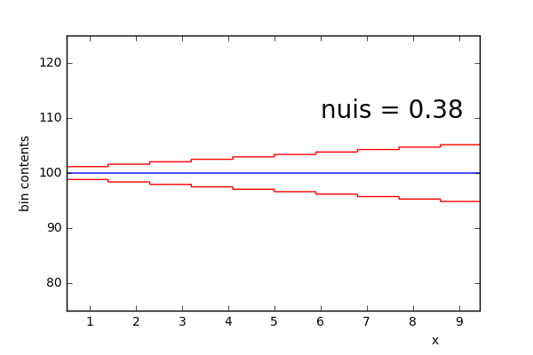

# Tools for creating RooFit workspaces

## Table builder

use as 

```
from TableBuilder import Model

m = Model()
```

A set of nuisance parameters are defined in a list and added to the model

```
m.add_nuisance_pars([list of values])
```

These values are the gradients of a modification to the sample where `High` and `Low` variations are scaled by the poisson error of the sample as such:


channels are required to have a set number of bins and are defined as such:
```
m.add_channel(10)	#A channel with 10 bins
m.add_channel(100)	#A channel with 100 bins
m.add_channel(1)	#A channel with a single bin
```

samples are added with a particular syntax. the first list is which channels this sample is added to, and the second is how many events to each. 
```
m.add_sample([0,2],[10,500])		# Adding a sample to first and third channels with 10 and 500 events respectively
m.add_sample([0,1,2],[1000,500,1000])	# Adding a sample to all three channels with 1000, 500 and 1000 events
```

In addition samples can be added as Signal (meaning they get a normalisation as a parameter of interest and the nominal shape is sloped rather than flat) and nuisance parameters can be added. Nuisance parameters are added as either a list of which nuisance parameters to be applied (to all channels) or as a tuple containing a list of which nuisance parameters followed by a list of channel lists. As so.
```
m.add_sample([0,2],[10,500],signal=True,shape='linear',histosys=([1,3,4],[[0],[0,2],[0,2]]))	#NPs 1,3,4 added to channels 0, 0+2 and 0+2
m.add_sample([0,1,2],[1000,500,10000],signal=False,shape='linear',histosys=[0,2,4])		#NPs 0,2,4 added to all channels
m.add_sample([1,2],[750,5000],signal=False,shape='linear',histosys=([0,2,3],[[1],[1,2],[2]]))	#NPs 0,2,3 added to various combinations of channels 1 and 2
```

A workspace is built using the following command.
```
w = m.BuildWorkspace()
```

the form of the table can be printed with:
```
>> m.Print()
+-----------+----------+--------+----------+---------+--------+--------+--------+--------+--------+
|  Channel  |  sample  | n bins | n events | signal? | nuis_0 | nuis_1 | nuis_2 | nuis_3 | nuis_4 |
+-----------+----------+--------+----------+---------+--------+--------+--------+--------+--------+
| channel_0 | sample_0 |   10   |    10    |   True  |        |   X    |        |   X    |   X    |
| channel_0 | sample_1 |   10   |   1000   |  False  |   X    |        |   X    |        |   X    |
| channel_1 | sample_1 |  100   |   500    |  False  |   X    |        |   X    |        |   X    |
| channel_1 | sample_2 |  100   |   750    |  False  |   X    |        |   X    |        |        |
| channel_2 | sample_0 |   1    |   500    |   True  |        |        |        |   X    |   X    |
| channel_2 | sample_1 |   1    |  10000   |  False  |   X    |        |   X    |        |   X    |
| channel_2 | sample_2 |   1    |   5000   |  False  |        |        |   X    |   X    |        |
+-----------+----------+--------+----------+---------+--------+--------+--------+--------+--------+
```
